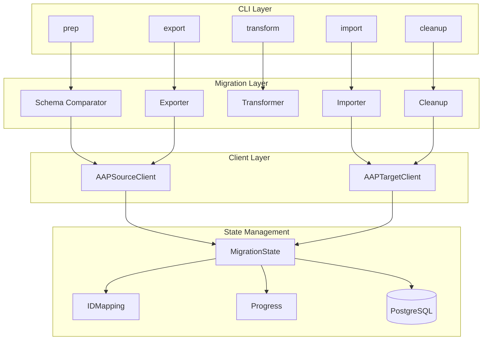

# Architecture

This document describes the internal architecture of AAP Bridge.

## Overview

AAP Bridge follows an ETL (Export, Transform, Load) architecture with state
management for checkpointing and idempotency.



## Directory Structure

```text
src/aap_migration/
├── cli/                    # Command-line interface
│   ├── main.py            # Entry point, command groups
│   ├── menu.py            # Interactive menu
│   ├── commands/          # Individual commands
│   │   ├── prep.py
│   │   ├── export_import.py
│   │   ├── cleanup.py
│   │   └── ...
│   └── utils.py           # CLI utilities
├── client/                 # HTTP clients
│   ├── aap_source_client.py
│   ├── aap_target_client.py
│   ├── vault_client.py
│   └── bulk_operations.py
├── migration/              # Core ETL logic
│   ├── coordinator.py     # Orchestration
│   ├── exporter.py        # Export logic
│   ├── transformer.py     # Transform logic
│   ├── importer.py        # Import logic
│   └── state.py           # State management
├── schema/                 # Schema handling
│   ├── comparator.py
│   └── models.py
├── validation/             # Validation logic
├── reporting/              # Progress and reports
│   ├── live_progress.py
│   └── report.py
├── config.py              # Configuration
├── resources.py           # Resource registry
└── utils/                 # Utilities
    ├── logging.py
    └── idempotency.py

```

## Key Components

### Client Layer

#### AAPSourceClient

HTTP client for the source AAP instance:

- Configured with host URL (`https://fqdn`) and `SOURCE__VERSION`
- Selects legacy (`/api/v2/`) or gateway topology from the configured version
- Handles pagination, rate limiting, retries, and token auth

#### AAPTargetClient

HTTP client for the target AAP instance:

- Same host-only configuration and auto-discovery as the source client
- On AAP 2.5+, routes shared resources (orgs, users, teams, RBAC) to
  `/api/gateway/v1/` and automation content to `/api/controller/v2/`
- Bulk operation support on controller endpoints

#### ApiLayout (`api_layout.py`)

Single source of truth for API path roots and version-aware routing:

- `SOURCE__VERSION` / `TARGET__VERSION` select legacy (`/api/v2/`) vs gateway topology
- Endpoint segment sets determine gateway vs controller base per request
- RBAC assignments route by `content_type` (including `shared.organization` /
  `shared.team` on gateway exports)
- `classic_rbac_conversion.py` maps legacy principal grants to role assignment
  rows when importing to gateway targets

### Migration Layer

#### Exporter

Exports resources from source AAP:

```python
class ResourceExporter:
    async def export_resources(
        self,
        resource_type: str,
        endpoint: str,
        page_size: int = 100,
    ) -> AsyncGenerator[dict, None]:
        """Paginate through all resources."""
        ...
```

Resource-specific exporters inherit from `ResourceExporter`:

- `OrganizationExporter`
- `InventoryExporter`
- `HostExporter`
- etc.

#### Transformer

Transforms data between AAP versions:

```python
class DataTransformer:
    DEPENDENCIES = {"organization": "organizations"}

    async def transform(
        self,
        data: dict[str, Any],
        state: MigrationState,
    ) -> dict[str, Any]:
        """Apply transformations."""
        ...

```

Transformations include:

- Field renames
- Type conversions
- Dependency resolution
- Default value injection

#### Importer

Imports resources to target AAP:

```python
class ResourceImporter:
    async def import_resource(
        self,
        resource_type: str,
        source_id: int,
        data: dict[str, Any],
    ) -> dict[str, Any] | None:
        """Import single resource."""
        ...

```

Special handling for:

- Bulk operations (hosts)
- Conflict resolution
- ID mapping

### State Management

#### MigrationState

Central state manager backed by PostgreSQL:

```python
class MigrationState:
    def mark_completed(
        self,
        resource_type: str,
        source_id: int,
        target_id: int,
    ) -> None: ...

    def get_mapped_id(
        self,
        resource_type: str,
        source_id: int,
    ) -> int | None: ...

    def is_migrated(
        self,
        resource_type: str,
        source_id: int,
    ) -> bool: ...

```

#### Database Schema

```sql
-- ID mappings
CREATE TABLE id_mapping (
    resource_type VARCHAR(100),
    source_id INTEGER,
    target_id INTEGER,
    source_name VARCHAR(512),
    PRIMARY KEY (resource_type, source_id)
);

-- Migration progress
CREATE TABLE migration_progress (
    resource_type VARCHAR(100),
    source_id INTEGER,
    status VARCHAR(50),
    error_message TEXT,
    updated_at TIMESTAMP
);

```

### Resource Registry

Central registry of all resource types:

```python
RESOURCE_REGISTRY = {
    "organizations": ResourceTypeInfo(
        name="organizations",
        endpoint="organizations/",
        migration_order=20,
        cleanup_order=100,
        has_exporter=True,
        has_importer=True,
    ),
    ...
}
```

Controls:

- Migration order (dependencies first)
- Cleanup order (dependents first)
- Batch sizes
- Bulk API usage

## Data Flow

### Export Flow

```text
Source AAP
    │
    ▼
AAPSourceClient.get()
    │
    ▼
ResourceExporter.export_resources()
    │
    ▼
File Writer (split by records-per-file)
    │
    ▼
exports/{resource_type}/{resource_type}_XXXX.json

```

### Transform Flow

```text
exports/{resource_type}/*.json
    │
    ▼
DataTransformer.transform()
    │
    ├── Remove deprecated fields
    ├── Rename changed fields
    ├── Add default values
    └── Resolve dependencies
    │
    ▼
transformed/{resource_type}/*.json

```

### Import Flow

```text
transformed/{resource_type}/*.json
    │
    ▼
ResourceImporter.import_resource()
    │
    ├── Check if already migrated (state)
    ├── Resolve FK dependencies (ID mapping)
    ├── Create/Update resource
    └── Record mapping
    │
    ▼
Target AAP (via AAPTargetClient)

```

## Extension Points

### Adding Resource Types

See [Adding Resource Types](adding-resource-types.md).

### Custom Transformers

Create a custom transformer for complex transformations:

```python
class CustomTransformer(DataTransformer):
    DEPENDENCIES = {"organization": "organizations"}
    REQUIRED_DEPENDENCIES = {"organization"}

    async def transform(
        self,
        data: dict[str, Any],
        state: MigrationState,
    ) -> dict[str, Any]:
        data = await super().transform(data, state)
        # Custom logic here
        return data

```

### Custom Importers

Override import behavior:

```python
class CustomImporter(ResourceImporter):
    async def import_resource(
        self,
        resource_type: str,
        source_id: int,
        data: dict[str, Any],
    ) -> dict[str, Any] | None:
        # Custom pre-processing
        ...
        return await super().import_resource(resource_type, source_id, data)

```

## Performance Considerations

### Concurrency

- Configurable via `max_concurrent`
- Uses `asyncio.Semaphore` for limiting
- Default: 10 concurrent requests

### Bulk Operations

- Hosts: 200 per bulk request
- Uses `/bulk/host_create` endpoint
- Significantly faster than individual creates

### Rate Limiting

- Configurable requests per second
- Exponential backoff on 429 responses
- Respects Retry-After headers

### Memory Management

- Streaming exports (generator-based)
- File splitting for large datasets
- Batched imports
